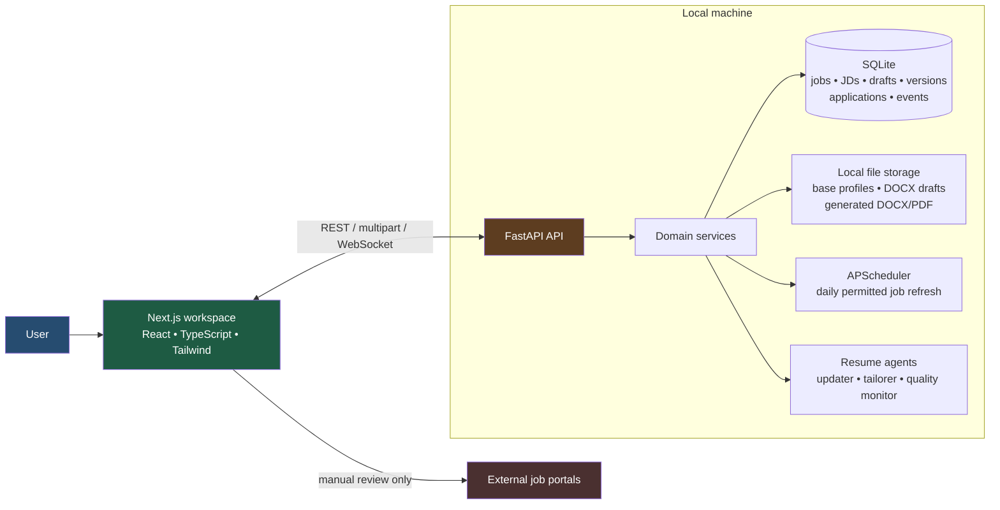
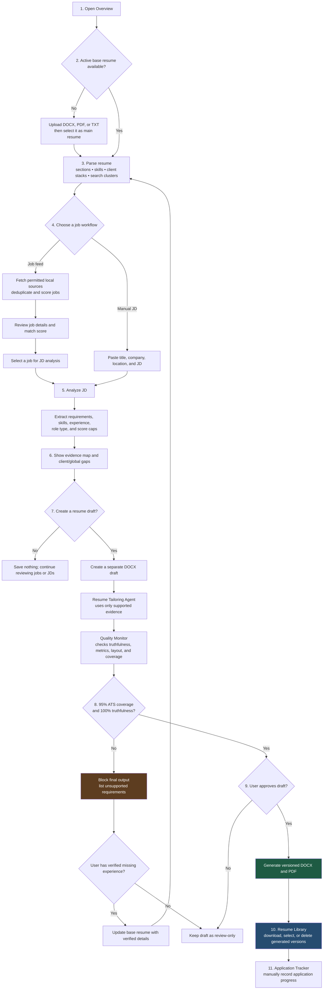

# Rolecraft

Rolecraft is a private, local-first workspace for discovering DevOps, SRE, cloud,
platform, infrastructure, observability, automation, and AI-infrastructure roles;
analyzing job descriptions; and preparing evidence-constrained resume drafts.

It runs entirely on the local machine. There are no accounts, cloud storage,
automatic applications, credential capture, CAPTCHA bypasses, or aggressive job-board
scraping.

## What it does

- Maintains multiple local base-resume profiles with one active profile.
- Parses the active resume into sections, first-two-client stacks, and separate Cloud,
  Platform, and MLOps search clusters.
- Fetches safe local sample jobs and supports pluggable, terms-respecting source handlers.
- Scores a job description deterministically without an OpenAI key.
- Shows requirements, evidence, missing skills, score caps, client gaps, and a
  requirement-to-evidence map.
- Creates versioned, reviewable DOCX drafts without modifying the active base resume.
- Preserves original experience bullets; any evidence-backed alignment bullet is inserted
  beneath its source bullet.
- Uses an independent quality monitor and a strict 95% evidence-backed ATS gate before
  final DOCX/PDF output.
- Tracks applications locally without submitting applications on the candidate's behalf.
- Lets users select individual generated versions or select all to delete their local
  artifacts safely.

## Architecture



External portals are intentionally outside Rolecraft's automation boundary: Rolecraft does
not log in, bypass restrictions, or submit an application.

## Step-by-step app flow



### Frontend

| Area | Responsibility |
|---|---|
| `frontend/src/app/` | Next.js App Router pages |
| `frontend/src/components/` | Interactive workspace UI |
| `frontend/src/lib/api.ts` | All browser-to-API requests and download URLs |
| `frontend/src/app/globals.css` | Theme and application styling |

Workspace routes:

| Route | Purpose |
|---|---|
| `/` | Product landing page |
| `/dashboard` | Overview, profile upload, active-resume selection, job refresh |
| `/jobs` | Curated job feed, detail view, re-analysis, manual application marking |
| `/manual-jd` | JD analysis, evidence map, draft generation, gated finalization |
| `/resumes` | Generated resume history, downloads, individual/select-all deletion |
| `/tracker` | Local application status tracking |
| `/monitor` | Runtime status for the JD scanner, scorer, tailorer, and monitor |
| `/approvals` | Human review queue for high-match full-time roles |

### Backend

| Area | Responsibility |
|---|---|
| `backend/main.py` | FastAPI contracts, validation, CORS, and thin route handlers |
| `backend/database/` | SQLite schema, connections, initialization/migrations |
| `backend/services/file_service.py` | Profile library, active-resume selection, local persistence |
| `backend/services/resume_parser.py` | Transparent resume structure, client stacks, title clusters |
| `backend/services/jd_analyzer.py` | JD analysis entry point |
| `backend/utils/scoring.py` | Deterministic skills, role, and evidence scoring |
| `backend/services/resume_update_planner.py` | Weighted gaps and evidence-backed update plan |
| `backend/services/resume_agents.py` | Tailoring and independent quality-monitor loop |
| `backend/services/resume_generator.py` | Versioned DOCX drafts/finals and local PDF conversion |
| `backend/services/resume_library.py` | Safe deletion of generated version artifacts |
| `backend/services/job_fetcher.py` | Mock/local and future source handlers with deduplication |
| `backend/services/scheduler.py` | Daily local refresh schedule |

SQLite contains `jobs`, `manual_jds`, `resume_drafts`, `resume_versions`,
`applications`, `job_sources`, `daily_fetch_logs`, `agent_events`, `notifications`, and
`fte_approvals`. The runtime database is stored under
`~/Library/Application Support/Rolecraft/`; existing legacy data can be migrated from
`backend/storage/`.

## Resume safety model

Rolecraft is intentionally evidence-first:

1. It derives requirements and a weighted baseline from the JD.
2. It maps each requirement to evidence in the selected base resume.
3. It can mirror supported terminology and add evidence-backed alignment content.
4. It never invents employers, tools, certifications, metrics, or experience.
5. Unsupported requirements remain visible as gaps.
6. A final version requires 95% evidence-backed ATS coverage, 100% truthfulness, monitor
   approval, and user approval.

This means a mainframe/IBM Z listing will remain blocked if the base resume does not
actually document Endevor, JCL, COBOL, DB2, DBB, UCD, or related experience.

Drafts are separate files. They do not overwrite the active base resume. Deleting a
generated version removes only its record and local DOCX/PDF artifacts; it does not delete
a base profile or a review draft. Application history is retained with its deleted version
reference cleared.

## Local setup

```bash
cd backend
python3 -m venv .venv
.venv/bin/pip install -r requirements.txt
cp .env.example .env

cd ../frontend
npm install
cp .env.example .env.local

cd ..
./run-local.sh
```

Local endpoints:

- App: `http://localhost:3001`
- API: `http://127.0.0.1:8000`
- API documentation: `http://127.0.0.1:8000/docs`
- Health: `http://127.0.0.1:8000/health`

`./run-local.sh` starts both services and stops both on `Ctrl+C`.

### Environment

`backend/.env`:

```dotenv
OPENAI_API_KEY=
FRONTEND_ORIGIN=http://localhost:3000
SCHEDULER_HOUR=8
SCHEDULER_MINUTE=0
```

`frontend/.env.local`:

```dotenv
NEXT_PUBLIC_API_URL=http://127.0.0.1:8000
```

The deterministic workflow works without `OPENAI_API_KEY`. PDF conversion requires a
local LibreOffice `soffice` installation. When it is unavailable, the approved draft stays
intact and Rolecraft reports the local setup requirement.

## API highlights

| Method | Endpoint | Purpose |
|---|---|---|
| `GET` | `/health` | Local service status |
| `POST` | `/resume/master/upload` | Add a DOCX, PDF, or TXT base profile |
| `GET` | `/resume/master/parse` | Read parsed structure, client stacks, search clusters |
| `POST` | `/resume/profiles/{id}/select` | Make a local profile active |
| `POST` | `/jobs/fetch` | Refresh permitted local sources |
| `POST` | `/manual-jd/analyze` | Analyze a pasted JD |
| `POST` | `/manual-jd/generate-resume/{id}` | Create a reviewable draft |
| `POST` | `/resume-drafts/{id}/approve` | Finalize a monitor-approved, 95%+ draft |
| `GET` | `/resumes` | List generated versions |
| `DELETE` | `/resumes` | Delete selected generated versions (`resume_ids`) |
| `GET` | `/resumes/{id}/download` | Download generated DOCX |
| `GET` | `/resumes/{id}/download/pdf` | Download generated PDF, when present |

## Repository guide

```text
resume-builder/
├── AGENTS.md
├── agents/                         # Contributor and runtime-agent profiles
├── skills/                         # Project-local Codex workflows
├── resumes/                        # Private profile registry (do not commit resumes)
├── backend/
│   ├── database/
│   ├── prompts/
│   ├── services/
│   ├── storage/
│   ├── utils/
│   └── main.py
├── frontend/
│   └── src/
│       ├── app/
│       ├── components/
│       └── lib/
├── run-local.sh
└── README.md
```

## Agent roles and project skills

Engineering profiles in [`agents/`](agents/README.md):

- `principal-architect`: cross-layer contracts, local storage, and major changes
- `frontend-engineer`: Next.js UI, accessibility, responsiveness, and API integration
- `backend-ai-engineer`: FastAPI, SQLite, analysis, document flows, and fetching
- `qa-devops-engineer`: runtime, regression checks, and operational documentation

Runtime resume roles:

- `resume-updater-agent`: evidence-backed gaps and update strategy
- `resume-tailoring-agent`: supported tailoring operations
- `resume-quality-monitor`: truthfulness, formatting, evidence, and gate checks

Project-local workflows in [`skills/`](skills/README.md):

- `$maintain-rolecraft-app`: safely implement and maintain Rolecraft features
- `$verify-rolecraft-workflows`: validate browser, API, SQLite, and generated-file flows
- `$resume-updater-agent`: build a structured, truth-first resume update plan
- `$docx`, `$pdf`, `$pdf-reading`, and `$file-reading`: local document handling support

## Technical documentation

The current repository diagrams and beginner-friendly operational guides are under `docs/`:

- [Current architecture](docs/architecture.md)
- [Request flow](docs/request-flow.md)
- [Build and deployment flow](docs/deployment-flow.md)
- [Configuration flow](docs/configuration-flow.md)
- [`docs/diagrams/`](docs/diagrams/) for standalone Mermaid sources

## Validation

```bash
cd backend
.venv/bin/python -m compileall main.py database services utils

cd ../frontend
npm run lint
npm run build
```

For workflow changes, also verify `/health`, the affected API contract, persisted SQLite
records, expected local artifacts, and the relevant desktop/mobile page states.

## Privacy and repository hygiene

Never commit `.env` files, local resumes, generated resumes, SQLite data, virtual
environments, `node_modules`, or `.next`. All resume data and generated files stay local.

## Additional API Scaffold

The `develop` branch also contains a standalone FastAPI resume CRUD scaffold under
`src/`. It exposes `/api/v1/resumes`, `/api/v1/health`, and `/api/v1/ready`, uses
in-memory storage for local development, and can be checked with:

```bash
.venv/bin/python -m compileall src
.venv/bin/python -m black --check src tests
.venv/bin/python -m flake8 src tests
.venv/bin/python -m pytest
```

Run that scaffold with:

```bash
.venv/bin/uvicorn src.main:app --reload --host 127.0.0.1 --port 8000
```
