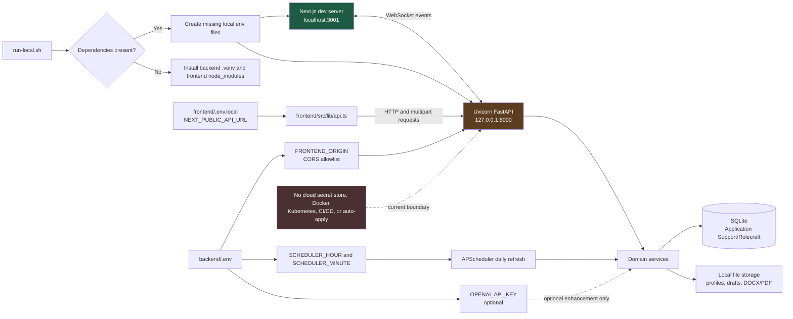

# Configuration flow

## Purpose

Explain how Rolecraft starts locally, how environment variables configure the frontend and
backend, and where requests and local runtime data flow.

## Diagram

## Step by step

1. `run-local.sh` stops immediately when the Python virtual environment or npm modules are
   absent; it does not install them automatically.
2. Once dependencies are present, it creates local `.env` files from their examples only when
   those files do not already exist.
3. It starts Next.js on `localhost:3001` and FastAPI on the IPv4 loopback interface,
   `127.0.0.1:8000`.
4. `NEXT_PUBLIC_API_URL` selects the API base URL for `frontend/src/lib/api.ts`; its fallback is
   the same IPv4 loopback URL used by FastAPI.
5. FastAPI loads `backend/.env`, applies `FRONTEND_ORIGIN` to its CORS allowlist, and starts the
   local scheduler during application startup.
6. APScheduler reads `SCHEDULER_HOUR` and `SCHEDULER_MINUTE`, then invokes the local job-fetch
   service on that daily schedule.
7. Domain services persist data in SQLite and artifacts only in the local profile/draft/output
   storage locations. Browser notifications use the `/ws/events` WebSocket endpoint.

## Configuration reference

| Variable | File | Used by | Default/meaning |
|---|---|---|---|
| `NEXT_PUBLIC_API_URL` | `frontend/.env.local` | `frontend/src/lib/api.ts` | FastAPI base URL; defaults to `http://127.0.0.1:8000` |
| `FRONTEND_ORIGIN` | `backend/.env` | `backend/main.py` | Extra CORS origin; local ports are already allowed |
| `SCHEDULER_HOUR` | `backend/.env` | `services/scheduler.py` | Daily refresh hour; default `8` |
| `SCHEDULER_MINUTE` | `backend/.env` | `services/scheduler.py` | Daily refresh minute; default `0` |
| `OPENAI_API_KEY` | `backend/.env` | Future/optional enhancement boundary | The deterministic workflow does not require it |

## Important files

- `run-local.sh`
- `backend/.env.example`
- `frontend/.env.example`
- `backend/main.py`
- `backend/services/scheduler.py`
- `frontend/src/lib/api.ts`

## Troubleshooting

- **Frontend points to the wrong API:** update `NEXT_PUBLIC_API_URL`, restart Next.js.
- **CORS failure:** set `FRONTEND_ORIGIN` to the exact frontend origin and restart FastAPI.
- **Scheduler runs at an unexpected time:** check `SCHEDULER_HOUR` and `SCHEDULER_MINUTE`.
- **API key missing:** leave it blank unless an optional future provider needs it; local scoring
  continues to work.

## Current security/configuration boundary

There is no CCM, cloud secret store, profile-based YAML selector, Kubernetes secret, or
deployment environment selector in the current repository. Local `.env` files are the
configuration mechanism and must never be committed.

See [the consolidated infrastructure guide](infrastructure-config-flow.md) for the
configuration reference and the full runtime flow in one place.
