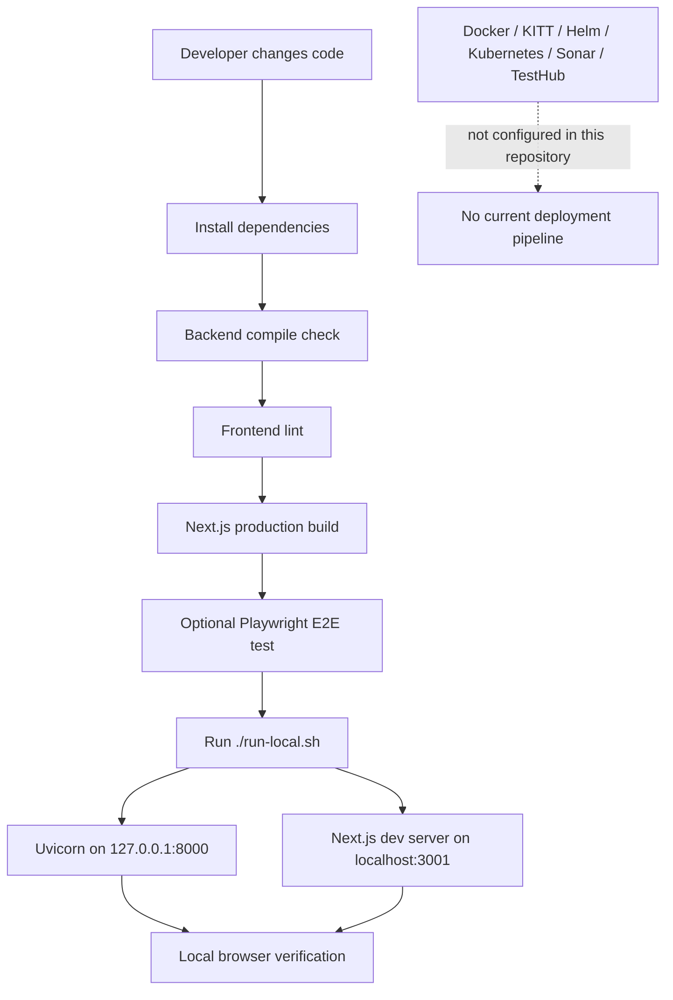

# Build and deployment flow

## Purpose

Document how this repository is built, tested, and run today. Rolecraft currently supports a
local development/runtime flow; no CI/CD or managed deployment configuration exists in the
repository.

## Diagram



## Step by step

1. Install Python dependencies in `backend/.venv` and npm dependencies in `frontend/`.
2. Run backend compilation to catch syntax/import problems.
3. Run ESLint and the Next.js production build.
4. Optionally run the Playwright tests after both local servers are available.
5. Run `./run-local.sh` for a two-process local runtime.
6. Verify browser flows and API health before sharing the change.

## Important files

| File | Role |
|---|---|
| `run-local.sh` | Checks prerequisites and starts Uvicorn plus Next.js |
| `frontend/package.json` | npm scripts for dev, build, lint, and Playwright |
| `frontend/playwright.config.ts` | E2E base URL and screenshot behavior |
| `frontend/tests/e2e/manual-jd.spec.ts` | Current browser E2E coverage |
| `backend/requirements.txt` | Python runtime dependencies |

## Current deployment status

No Dockerfile, Docker Compose file, `.looper.yml`, `kitt.yml`, Helm chart, Kubernetes/WCNP
manifest, profile YAML, CI workflow, Sonar configuration, TestHub configuration, or
performance-test configuration was found. Therefore, no dev/stage/teflon/prod/prodb
environment path is currently implemented.

## Commands

```bash
# Backend syntax check
cd backend
.venv/bin/python -m compileall main.py database services utils

# Frontend quality checks
cd ../frontend
npm run lint
npm run build

# Start the complete local application from the repository root
cd ..
./run-local.sh

# Optional E2E test once the app and API are running
cd frontend
npm run test:e2e
```

## Optional documentation tooling

Mermaid diagrams render in GitHub-compatible Markdown without an installed package. To export
the `.mmd` sources to SVG/PNG and validate Markdown locally, use the repository's npm package
manager from `frontend/`:

```bash
cd frontend
npm install --save-dev @mermaid-js/mermaid-cli markdownlint-cli

# Export one diagram as SVG or PNG
npx mmdc -i ../docs/diagrams/architecture.mmd -o ../docs/diagrams/architecture.svg
npx mmdc -i ../docs/diagrams/request-flow.mmd -o ../docs/diagrams/request-flow.png

# Validate the documentation
npx markdownlint-cli ../README.md ../docs/**/*.md
```

These packages are recommendations only and are not currently installed. There is no current
Sonar scan command; add one only after a Sonar server/project configuration is introduced.

## Troubleshooting

- **Port conflict:** stop the earlier process, then rerun `./run-local.sh`.
- **E2E cannot reach the app:** start `./run-local.sh` first; Playwright uses port `3001`.
- **Build fails:** run `npm install` in `frontend/` and check TypeScript/ESLint output.
- **No Sonar or KITT command:** these tools are not configured; see recommended improvements.
