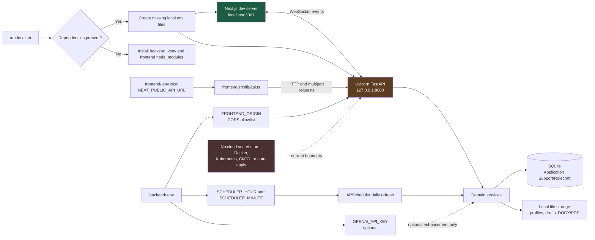

# Local infrastructure and configuration flow

## Scope

Rolecraft runs as two local processes on one machine. The browser-facing Next.js workspace
communicates with a FastAPI service over the loopback network; business services persist only to
local SQLite and local files.

## Infrastructure flowchart

## Configuration reference

| Variable | Local file | Runtime consumer | Behavior |
|---|---|---|---|
| `NEXT_PUBLIC_API_URL` | `frontend/.env.local` | `frontend/src/lib/api.ts` | Chooses the FastAPI base URL; defaults to `http://127.0.0.1:8000`. |
| `FRONTEND_ORIGIN` | `backend/.env` | `backend/main.py` | Adds an allowed browser origin to FastAPI CORS. Local ports `3000` and `3001` are already allowed. |
| `SCHEDULER_HOUR` | `backend/.env` | `backend/services/scheduler.py` | Daily job-refresh hour; defaults to `8`. |
| `SCHEDULER_MINUTE` | `backend/.env` | `backend/services/scheduler.py` | Daily job-refresh minute; defaults to `0`. |
| `OPENAI_API_KEY` | `backend/.env` | Optional enhancement boundary | The deterministic analysis workflow works without it. |

## Startup and request flow

1. `run-local.sh` verifies `backend/.venv/bin/uvicorn` and `frontend/node_modules` exist.
2. Missing local environment files are copied from `.env.example`; existing local settings are
   preserved.
3. Uvicorn starts FastAPI on `127.0.0.1:8000`; Next.js starts on `localhost:3001`.
4. Browser code uses only `frontend/src/lib/api.ts` for HTTP, multipart upload, and download URLs.
5. FastAPI validates requests, delegates business work to `backend/services/`, and returns JSON or
   local-file responses. `/ws/events` supplies runtime events to the workspace.
6. The scheduler invokes the local job-fetch workflow daily. Services write local SQLite records
   and local resume/draft artifacts; no cloud service is required.

## Boundaries

- No authentication, cloud storage, automatic application submission, Docker, Kubernetes, CI/CD,
  cloud secret manager, or deployment-environment selector is configured.
- Local `.env` files contain the runtime configuration and must not be committed.
- The API deliberately binds to IPv4 loopback. Keeping the frontend fallback at
  `127.0.0.1:8000` avoids `localhost` resolving to IPv6 when FastAPI is not listening on `::1`.

## Source files

- `run-local.sh`
- `backend/.env.example`
- `frontend/.env.example`
- `backend/main.py`
- `backend/services/scheduler.py`
- `frontend/src/lib/api.ts`
- `docs/diagrams/configuration-flow.mmd`
