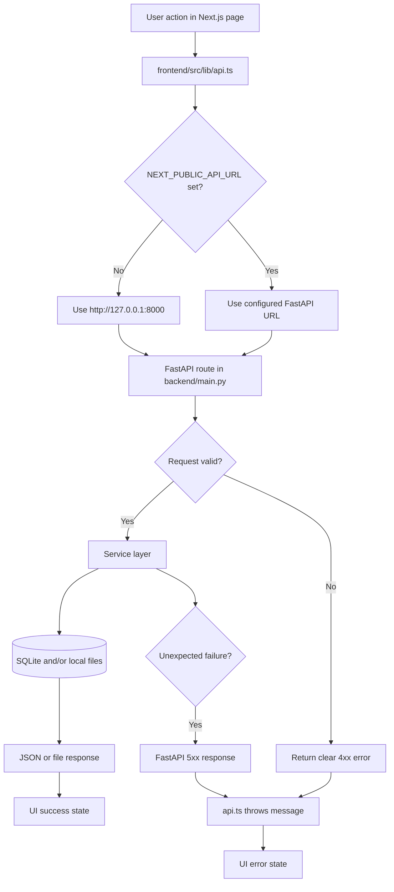

# Request flow

## Purpose

Show how a browser request reaches Rolecraft's local backend, how configuration selects the
target API endpoint, and how errors return to the interface.

## Diagram

## Step by step

1. A user triggers an action, such as uploading a resume or analyzing a JD.
2. The component calls `api()` from `frontend/src/lib/api.ts`; components do not call the
   backend directly.
3. `NEXT_PUBLIC_API_URL` selects the backend. Without it, the loopback default is
   `http://127.0.0.1:8000`.
4. FastAPI validates the request and calls a service.
5. The service uses SQLite or local files as required, then returns data to the route.
6. The UI renders a result, download link, loading state, or clear error message.

## Example: manual JD analysis

`ManualJDClient` posts title, company, location, and description to
`POST /manual-jd/analyze`. The route calls `services/jd_analyzer.py`, stores the analysis in
`manual_jds`, records agent activity, and returns the score, evidence, gaps, and update plan.

## Important files

- `frontend/src/lib/api.ts`
- `frontend/src/components/ManualJDClient.tsx`
- `backend/main.py`
- `backend/services/jd_analyzer.py`
- `backend/services/resume_update_planner.py`
- `backend/database/db.py`

## Troubleshooting

- **Browser cannot connect:** check `NEXT_PUBLIC_API_URL` and run `curl` against `/health`.
- **CORS error:** ensure `FRONTEND_ORIGIN` matches the frontend URL; localhost ports `3000`
  and `3001` are allowed by default.
- **4xx response:** correct the user input; the API error text is intended for display.
- **5xx response:** inspect the backend terminal and confirm local database/file permissions.
